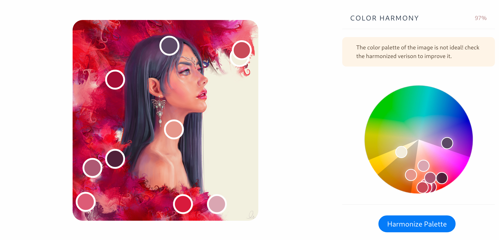

# Aiart #
Get an intelligent advise for your drawings and paintings with and personal art advisor 
powered with AI. With aiart you can instantly obtain a detailed analysis of its composition balance
and color harmony. 

Using graph-based image segmentation the weight of each segment of the image can be calculated accuretly, 
more complitaded images can use what we call as an **accuracy mode** where a deep neural network will calculate 
even more precise details of the images such as faces and  small but important objects. Aiart is able to balance
the image with just the click of a button. 

Each painting has its unique color pallete, that is why with a color bucketing algorithm we are able to calculate 
the most precise pallete as possible. The color pallete of an image is composed of the most important colors in it. 
With aiart you can get a distribution of pallete and how moving different colors improves its harmony. 

